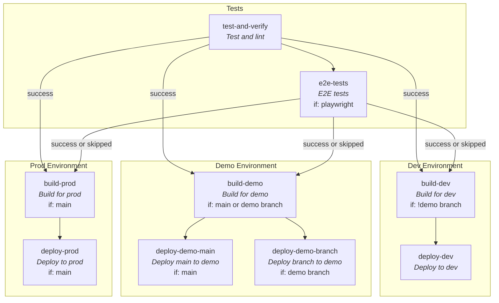

# teamesyfo-github-actions-workflows

This is a repository for GitHub actions workflows for teamesyfo

## 🚀 Usage

### Deploying a Next application (next-app.yaml)



Builds 1 app per environment. Supports deploying demo-prefixed branches to their own ingress. Demo-applications will be deleted in 48 hours.

<details>
<summary>Detailed instructions</summary>
Add a new github workflow `deploy-app.yaml` with the following:

```yaml
name: Build & Deploy
on: push

jobs:
  next-app:
    uses: navikt/teamesyfo-github-actions-workflows/.github/workflows/next-app.yaml@main
    secrets: inherit
    with:
      app: REPLACE_ME
      base-path: REPLACE_ME
```

#### **Important:**

This reusable workflows make the following assumptions:

1. There is a `Dockerfile` on root

   This dockerfile NEEDS to accept the argument `ENV` (`ARG ENV`) and copy the following: `COPY nais/envs/.env.$ENV /app/.env.production`

2. The naiserator files must be in the `nais` folder, named `nais-dev.yaml`, `nais-demo.yaml` and `nais-prod.yaml`.

   The `nais.demo.yaml` needs to be parameterized with the following:

   ```yaml
   apiVersion: 'nais.io/v1alpha1'
   kind: 'Application'
   metadata:
     name: {{appname}}-demo
     namespace: team-esyfo
     labels:
       team: team-esyfo
       branchState: {{branchState}}
   spec:
     image: {{image}}
     port: 3000
     ingresses:
       - {{ingress}}
     replicas:
       min: {{replicas}}
       max: {{replicas}}
   ```

   This is to support deploying branches to their own ingress.

3. There needs to be a `nais/envs` folder with the following files: `.env.dev`, `.env.demo`, `.env.prod`. These envs will be available both during build and runtime.

   Note: Normal runtime-only (e.g. backend-only) envs can still be added in the nais.yaml.
   </details>

### Deploying a Ktor or Spring Boot application (jar-app.yaml)

<details>
<summary>Detailed instructions</summary>

#### 1. Add a new github workflow `deploy-app.yaml` with the following:

```yaml
name: Build & Deploy
on: push

jobs:
  jar-app:
    uses: navikt/teamesyfo-github-actions-workflows/.github/workflows/jar-app.yaml@main
    secrets: inherit
    with:
      app: REPLACE_ME
```

</details>

#### 2. The naiserator files must be in the `nais` folder, named `nais-dev.yaml` and `nais-prod.yaml`.

## 👥 Contact

This project is maintained by [navikt/team-esyfo](CODEOWNERS)

If you work in [@navikt](https://github.com/navikt) you can reach us at the Slack
channel [#esyfo](https://nav-it.slack.com/archives/C012X796B4L)
