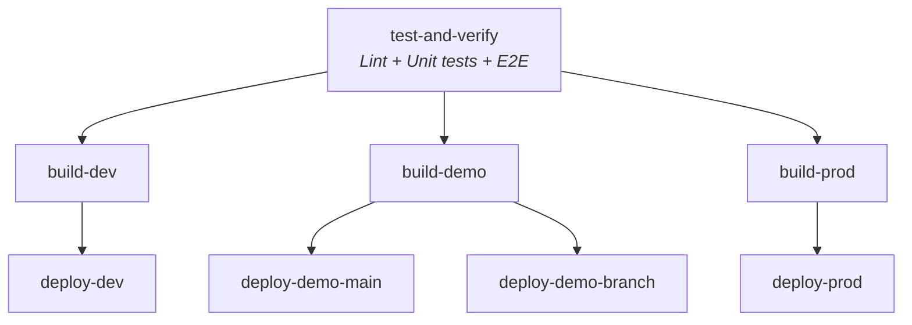

# teamesyfo-github-actions-workflows

This is a repository for GitHub actions workflows for teamesyfo

## 🚀 Usage

### Deploying a Next application (next-app.yaml)


```mermaid
flowchart TD
    A[test-and-verify<br><i>Lint + Unit tests + E2E</i>] --> B[build-dev]
    A --> C[build-demo]
    A --> D[build-prod]
    B --> E[deploy-dev]
    C --> F[deploy-demo-main]
    C --> G[deploy-demo-branch]
    D --> H[deploy-prod]
```

Builds 1 app per environment. Supports deploying demo-prefixed branches to their own ingress. Demo-applications will be deleted in 48 hours.

<details>
<summary>Detailed instructions</summary>
Add a new github workflow `deploy-app.yaml` with the following:

```yaml
name: Build & Deploy
on: push

jobs:
  next-app:
    uses: navikt/teamesyfo-github-actions-workflows/.github/workflows/next-app.yaml@main
    secrets: inherit
    with:
      app: REPLACE_ME
      base-path: REPLACE_ME
```

#### **Important:**

This reusable workflows make the following assumptions:

1. There is a `Dockerfile` on root

   This dockerfile NEEDS to accept the argument `ENV` (`ARG ENV`) and copy the following: `COPY nais/envs/.env.$ENV /app/.env.production`

2. The naiserator files must be in the `nais` folder, named `nais-dev.yaml`, `nais-demo.yaml` and `nais-prod.yaml`.

   The `nais.demo.yaml` needs to be parameterized with the following:

   ```yaml
   apiVersion: 'nais.io/v1alpha1'
   kind: 'Application'
   metadata:
     name: {{appname}}-demo
     namespace: team-esyfo
     labels:
       team: team-esyfo
       branchState: {{branchState}}
   spec:
     image: {{image}}
     port: 3000
     ingresses:
       - {{ingress}}
     replicas:
       min: {{replicas}}
       max: {{replicas}}
   ```

   This is to support deploying branches to their own ingress.

3. There needs to be a `nais/envs` folder with the following files: `.env.dev`, `.env.demo`, `.env.prod`. These envs will be available both during build and runtime.

   Note: Normal runtime-only (e.g. backend-only) envs can still be added in the nais.yaml.
   </details>

### Deploying a Ktor or Spring Boot application (jar-app.yaml)

<details>
<summary>Detailed instructions</summary>

#### 1. Add a new github workflow `deploy-app.yaml` with the following:

```yaml
name: Build & Deploy
on: push

jobs:
  jar-app:
    uses: navikt/teamesyfo-github-actions-workflows/.github/workflows/jar-app.yaml@main
    secrets: inherit
    with:
      app: REPLACE_ME
```

</details>

#### 2. The naiserator files must be in the `nais` folder, named `nais-dev.yaml` and `nais-prod.yaml`.

### Auto-merging Dependabot PRs (dependabot-automerge.yaml)

Auto-approves and enables auto-merge for safe Dependabot PRs. GitHub Actions updates are always auto-merged (including major), while other ecosystems are limited to patch and minor updates.

Uses `gh pr merge --auto --squash`, which means GitHub will only merge when branch protection or ruleset requirements are satisfied. **If you do not have required checks configured, the PR may merge immediately after this workflow runs.**

See [docs/dependabot-automerge.md](docs/dependabot-automerge.md) for the full setup, a Mermaid flow diagram, and troubleshooting tips.

<details>
<summary>Quick start</summary>

#### Prerequisites

1. Grant the [`teamesyfo-automerge`](https://github.com/apps/teamesyfo-automerge) GitHub App repository access to the consumer repo.
2. Add the app private key as a GitHub **Dependabot secret** in the consumer repo (for example `AUTOMERGE_APP_PRIVATE_KEY`).
3. Enable **Allow auto-merge** in the repository settings (Settings → General → Pull Requests).
4. Enable **Allow GitHub Actions to create and approve pull requests** in the repository settings (Settings → Actions → General → Workflow permissions). Workflow permissions must be set to **Read and write permissions**.
5. Configure at least one required CI check on the default branch through branch protection or rulesets. If the repository uses **merge queue** (the expected setup for Team eSyfo repos), the required workflow must also trigger on `merge_group`.

#### Setup

Add a workflow file (e.g. `.github/workflows/dependabot-automerge.yaml`):

```yaml
name: Dependabot auto-approve and auto-merge
on:
  pull_request:
    types: [opened, reopened, synchronize]

jobs:
  automerge:
    permissions:
      contents: write
      pull-requests: write
    uses: navikt/teamesyfo-github-actions-workflows/.github/workflows/dependabot-automerge.yaml@main
    secrets:
      APP_PRIVATE_KEY: ${{ secrets.AUTOMERGE_APP_PRIVATE_KEY }}
```

`AUTOMERGE_APP_PRIVATE_KEY` must be stored as a GitHub **Dependabot secret**. On Dependabot-triggered runs, regular Actions secrets are not available, so a normal repository secret is not enough.

The current implementation uses `GITHUB_TOKEN` to approve the PR, then creates a short-lived GitHub App token from `APP_PRIVATE_KEY` to enable auto-merge. The GitHub App token is what avoids the `GITHUB_TOKEN` limitation around `merge_group` validations.

#### Policy

| Update type | Auto-merged? |
|-------------|-------------|
| GitHub Actions | ✅ Yes, including major |
| Patch (non-GitHub Actions) | ✅ Yes |
| Minor (non-GitHub Actions) | ✅ Yes |
| Major (non-GitHub Actions) | ❌ No — requires manual review |

The policy applies to both production and development dependencies.

</details>

## 👥 Contact

This project is maintained by [navikt/team-esyfo](CODEOWNERS)

If you work in [@navikt](https://github.com/navikt) you can reach us at the Slack
channel [#esyfo](https://nav-it.slack.com/archives/C012X796B4L)
