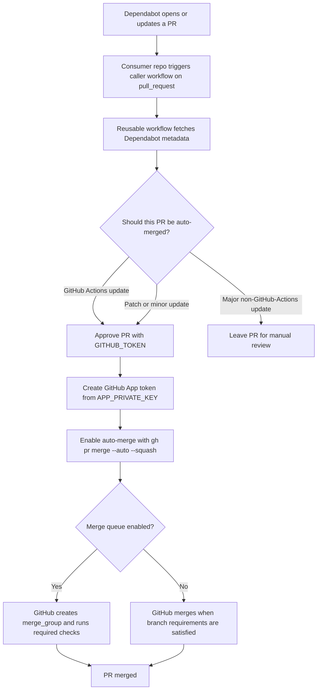

# Dependabot auto-merge

This document explains how to use `dependabot-automerge.yaml` from `navikt/teamesyfo-github-actions-workflows`, what must be configured in the consumer repository, and how the merge queue flow works.

## Flow overview



## What the reusable workflow does

The reusable workflow currently:

1. Verifies that the PR author is `dependabot[bot]` and that the PR does not come from a fork.
2. Reads Dependabot metadata to determine ecosystem and update type.
3. Approves eligible PRs with `GITHUB_TOKEN`.
4. Creates a short-lived GitHub App token from `APP_PRIVATE_KEY`.
5. Enables auto-merge with `gh pr merge --auto --squash` using the GitHub App token.

This wording matches the workflow implementation as it exists today: the approval step uses `GITHUB_TOKEN`, while the merge step uses the GitHub App token. The GitHub App token is important when the consumer repository uses merge queue, because `GITHUB_TOKEN` cannot trigger the `merge_group` validations needed by merge queue.

## Prerequisites in the consumer repo

Before adding the caller workflow, make sure the consumer repo has the following in place:

### 1. GitHub App access

Grant the [`teamesyfo-automerge`](https://github.com/apps/teamesyfo-automerge) GitHub App repository access to the consumer repository.

Without explicit repo access, the app cannot mint an installation token for that repo, and the workflow cannot enable auto-merge.

### 2. Dependabot secret

Add the app private key as a GitHub **Dependabot secret** in the consumer repository.

Recommended secret name:

- `AUTOMERGE_APP_PRIVATE_KEY`

Why a Dependabot secret?

- Dependabot-triggered workflow runs do not get access to regular Actions secrets.
- The caller workflow reads the secret via `${{ secrets.AUTOMERGE_APP_PRIVATE_KEY }}` and passes it to the reusable workflow as `APP_PRIVATE_KEY`.

### 3. Repository settings

Enable the following settings in the consumer repository:

- **Allow auto-merge** in Settings -> General -> Pull Requests
- **Read and write permissions** for workflows in Settings -> Actions -> General
- **Allow GitHub Actions to create and approve pull requests** in Settings -> Actions -> General

### 4. Required CI checks and merge queue

The repository should require at least one CI check on the default branch. Without required checks, Dependabot PRs may merge immediately after the workflow enables auto-merge.

GitHub auto-merge does not strictly require merge queue. It can also work with ordinary branch protection or rulesets plus required checks.

For Team eSyfo repositories, though, merge queue should be treated as the expected setup. If the repository uses **merge queue**, the required CI workflow must also run on `merge_group`.

## Caller workflow example

Create a workflow such as `.github/workflows/dependabot-automerge.yaml`:

```yaml
name: Dependabot auto-approve and auto-merge

on:
  pull_request:
    types: [opened, reopened, synchronize]

jobs:
  automerge:
    permissions:
      contents: write
      pull-requests: write
    uses: navikt/teamesyfo-github-actions-workflows/.github/workflows/dependabot-automerge.yaml@main
    secrets:
      APP_PRIVATE_KEY: ${{ secrets.AUTOMERGE_APP_PRIVATE_KEY }}
```

## Merge queue example

If the consumer repository uses merge queue, make sure its CI workflow also listens to `merge_group`:

```yaml
name: CI

on:
  pull_request:
  merge_group:
    types: [checks_requested]

jobs:
  build:
    runs-on: ubuntu-latest
    steps:
      - run: echo "run required checks here"
```

The job name used as a required check should be stable, so the merge queue can keep validating PRs after auto-merge is enabled.

## Policy

Current policy:

- GitHub Actions updates: always auto-merge, including major updates
- Other ecosystems: auto-merge patch and minor updates
- Other ecosystems: leave major updates for manual review

## Team eSyfo operational note

For Team eSyfo repositories, the private key is managed outside GitHub and copied into each target repository as a Dependabot secret before the workflow is enabled.

If you are doing the setup for Team eSyfo, confirm both of these before rollout:

- the `teamesyfo-automerge` app has repository access to the target repo
- the target repo has a Dependabot secret containing the current app private key

## Troubleshooting

### `APP_PRIVATE_KEY` is missing

Make sure the consumer repository has the private key stored as a **Dependabot secret**, not only as a regular Actions secret.

### The PR is approved but never enters merge queue

Check:

- that auto-merge is enabled in repository settings
- that the GitHub App has access to the repository
- that the workflow can read the Dependabot secret

### Merge queue never runs checks

Make sure the required CI workflow listens to:

```yaml
merge_group:
  types: [checks_requested]
```

### The PR merged immediately

This usually means the consumer repository has no required checks configured on the default branch or ruleset.
