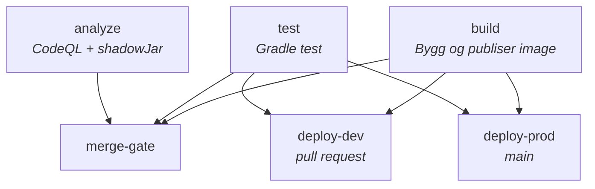

# JVM-workflows

Denne guiden beskriver `jar-app.yaml`, som er den aktive og anbefalte JVM-workflowen i repoet.

`boot-jar-app.yaml` og `fss-boot-jar-app.yaml` finnes fortsatt av legacy-årsaker, men er ikke beskrevet videre her.

## Aktiv JVM-workflow

Bruk denne workflowen når applikasjonen bygger en `shadowJar`. Workflowen bygger Docker-image, kjører tester, har egen merge-gate og deployer med `nais/deploy/actions/deploy` til `dev-gcp` og `prod-gcp`.

## Inputs

| Input          | Påkrevd | Standard | Beskrivelse                                                       |
| -------------- | ------- | -------- | ----------------------------------------------------------------- |
| `app`          | Ja      | –        | Navn på applikasjonen.                                            |
| `java-version` | Nei     | `19`     | Java-versjon for `actions/setup-java` og `actions/gradle-cached`. |

## Krav i consumer-repoet

1. Opprett en caller-workflow i consumer-repoet som bruker den reusable workflowen med `secrets: inherit`.
2. Ha en `Dockerfile` i rotmappen som passer til artifactet prosjektet bygger.
3. Ha NAIS-manifester i `nais/`:
   - `nais/nais-dev.yaml`
   - `nais/nais-prod.yaml`
4. Prosjektet må bruke Gradle wrapper. `actions/gradle-cached` validerer wrapperen og setter opp Gradle-cache.
5. Hvis prosjektet henter private avhengigheter fra GitHub Packages, bruker workflowene `ORG_GRADLE_PROJECT_githubUser=x-access-token` og `ORG_GRADLE_PROJECT_githubPassword=${{ secrets.GITHUB_TOKEN }}` i build- og test-steg.

## Flyt

Hovedflyten i `jar-app.yaml` ser slik ut:



`merge-gate` samler status fra `analyze`, `test` og `build` for branch protection. `deploy-dev` kjører for pull requests som ikke er draft og ikke kommer fra Dependabot, mens `deploy-prod` kjører på `main`.

## Eksempel

```yaml
name: Build and deploy

on:
  pull_request:
  push:
    branches:
      - main

jobs:
  jar-app:
    uses: navikt/teamesyfo-github-actions-workflows/.github/workflows/jar-app.yaml@main
    secrets: inherit
    with:
      app: my-jar-app
```
