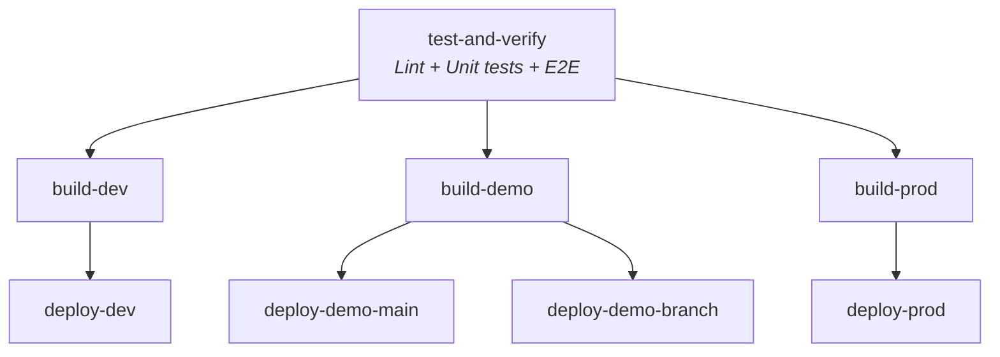

# Next.js-workflows

Denne guiden dekker begge Next.js-workflowene i repoet:

- `.github/workflows/next-app.yaml` (legacy npm)
- `.github/workflows/next-app-v2.yaml`

Begge workflowene bygger én app per miljø, støtter demo-brancher med egen ingress og bruker `nais/nais-demo.yaml` for demo-deploy.

## Flyt



## Når du skal bruke hvilken workflow

| Workflow-fil       | Bruk når                                    | Verifiserte forskjeller                                                                                                                                                                                                                                                                           |
| ------------------ | ------------------------------------------- | ------------------------------------------------------------------------------------------------------------------------------------------------------------------------------------------------------------------------------------------------------------------------------------------------- |
| `next-app.yaml`    | Repoet bruker `npm` og `package-lock.json`. | Standard `node-version` er `20.x`. Tester kjører via `actions/npm-cached` og bygg via `actions/next-to-docker`. E2E styres av string-inputen `e2e-test-framework`, der `playwright` er eneste støttede verdi. Workflowen har ikke merge-gate og deploy-jobbene har ikke egen `merge_group`-guard. |
| `next-app-v2.yaml` | Repoet bruker `pnpm` og `pnpm-lock.yaml`.   | Standard `node-version` er `24.x`. Tester kjører via `actions/setup-pnpm` og bygg via `actions/build-next-app`. E2E styres av boolean-inputen `run-e2e-tests`. Workflowen har en egen `merge-gate`-jobb og alle deploy-jobber hopper over kjøring når eventen er `merge_group`.                   |

## Inputs

### Felles inputs

| Input          | Påkrevd | Beskrivelse                                                                           |
| -------------- | ------- | ------------------------------------------------------------------------------------- |
| `app`          | Ja      | Navn på applikasjonen.                                                                |
| `base-path`    | Ja      | Base path for ingress, for eksempel `/min-app`.                                       |
| `node-version` | Nei     | Node.js-versjon. Standard er `20.x` i `next-app.yaml` og `24.x` i `next-app-v2.yaml`. |

### Workflow-spesifikke inputs

| Workflow-fil       | Input                | Standard | Beskrivelse                                                                       |
| ------------------ | -------------------- | -------- | --------------------------------------------------------------------------------- |
| `next-app.yaml`    | `e2e-test-framework` | `""`     | Sett til `playwright` for å kjøre `actions/playwright-e2e`.                       |
| `next-app-v2.yaml` | `run-e2e-tests`      | `false`  | Sett til `true` for å kjøre `actions/playwright-e2e` med `package-manager: pnpm`. |

## Krav i consumer-repoet

### Gjelder begge workflowene

1. Opprett en caller-workflow i consumer-repoet som bruker den reusable workflowen med `secrets: inherit`.
2. Ha en `Dockerfile` i rotmappen. Build-actionene bygger applikasjonen først og bruker deretter `nais/docker-build-push` til å bygge image fra repoet.
3. Ha NAIS-manifester i `nais/`:
   - `nais/nais-dev.yaml`
   - `nais/nais-demo.yaml`
   - `nais/nais-prod.yaml`
4. Ha miljøfiler i `nais/envs/`:
   - `nais/envs/.env.dev`
   - `nais/envs/.env.demo`
   - `nais/envs/.env.prod`

Begge build-actionene kopierer riktig fil til `.env.production` før `npm run build` eller `pnpm run build`.

### Krav for demo-deploy

`deploy-demo-main` og `deploy-demo-branch` bruker `nais/nais-demo.yaml` med variablene som workflowene sender inn:

- `image`
- `ingress`
- `appname`
- `replicas`
- `branchState`

`deploy-demo-branch` sender også inn `ttl=168h`. Bruk den hvis manifestet skal sette levetid på demo-brancher.

### Krav per workflow

| Workflow-fil       | Ekstra krav                                                                                                                                                                                                                      |
| ------------------ | -------------------------------------------------------------------------------------------------------------------------------------------------------------------------------------------------------------------------------- |
| `next-app.yaml`    | Repoet må kunne installeres med `npm ci`, som i praksis betyr `package-lock.json`. Hvis du vil kjøre E2E, må repoet ha Playwright-oppsett som kan kjøres med standardkommandoen fra `actions/playwright-e2e`.                    |
| `next-app-v2.yaml` | Repoet må kunne installeres med `pnpm install --frozen-lockfile`, som i praksis betyr `pnpm-lock.yaml`. Hvis du vil kjøre E2E, må repoet ha Playwright-oppsett som kan kjøres med `pnpm playwright test --reporter=html,github`. |

## Deploy- og merge-regler

### `next-app.yaml`

- `build-dev` kjører når branchen ikke starter med `demo`
- `build-demo` kjører på `main` og brancher som starter med `demo`
- `build-prod` kjører bare på `main`
- `deploy-dev` kjører ikke for Dependabot og ikke for draft pull requests
- `deploy-demo-main` kjører bare på `main`
- `deploy-demo-branch` kjører bare på brancher som starter med `demo`
- `deploy-prod` kjører bare på `main`

### `next-app-v2.yaml`

Samme byggelogikk som over, men med to ekstra vakter:

- `merge-gate` samler `test-and-verify` og `build-dev` i én stabil required check for branch protection
- alle deploy-jobber hopper over kjøring når eventen er `merge_group`

## Eksempel: `next-app-v2.yaml`

```yaml
name: Build and deploy

on:
  pull_request:
  merge_group:
    types: [checks_requested]
  push:
    branches:
      - main
      - demo*

jobs:
  next-app:
    uses: navikt/teamesyfo-github-actions-workflows/.github/workflows/next-app-v2.yaml@main
    secrets: inherit
    with:
      app: my-next-app
      base-path: /my-next-app
      run-e2e-tests: true
```
