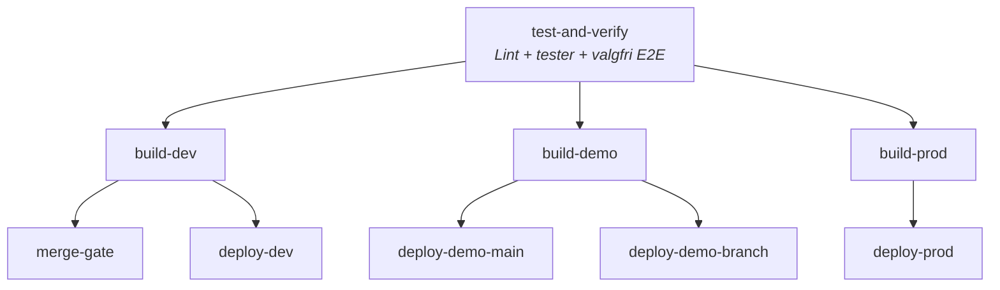

# Next.js-workflow

`next-app-v2.yaml` er den anbefalte workflowen for Next.js-apper i dette repoet. `next-app.yaml` er legacy, bygger på npm og fjernes snart.

`next-app-v2.yaml` kjører lint og tester, bygger appen for dev, demo og prod, og deployer til riktig miljø. Workflowen støtter også demo-brancher med egen ingress og bruker `nais/nais-demo.yaml` for demo-deploy.

Hovedflyten i `next-app-v2.yaml` ser slik ut



## Viktigste inputs

| Input           | Påkrevd | Beskrivelse                                            |
| --------------- | ------- | ------------------------------------------------------ |
| `app`           | Ja      | Navn på applikasjonen.                                 |
| `base-path`     | Ja      | Base path for ingress, for eksempel `/min-app`.        |
| `node-version`  | Nei     | Node.js-versjon. Standard er `24.x`.                   |
| `run-e2e-tests` | Nei     | Sett til `true` for å kjøre Playwright-E2E med `pnpm`. |

## Krav i consumer-repoet

1. Opprett en caller-workflow som bruker `.github/workflows/next-app-v2.yaml` med `secrets: inherit`.
2. Repoet må bruke `pnpm` og ha `pnpm-lock.yaml`.
3. Repoet må kunne kjøre `pnpm run lint`, `pnpm run test` og `pnpm run build`.
4. Hvis du setter `run-e2e-tests: true`, må Playwright kunne kjøres med `pnpm playwright test --reporter=html,github`.
5. Ha en `Dockerfile` i rotmappen.
6. Ha NAIS-manifester i `nais/`:
   - `nais/nais-dev.yaml`
   - `nais/nais-demo.yaml`
   - `nais/nais-prod.yaml`
7. Ha miljøfiler i `nais/envs/`:
   - `nais/envs/.env.dev`
   - `nais/envs/.env.demo`
   - `nais/envs/.env.prod`

Build-steget kopierer riktig miljøfil til `.env.production` før appen bygges.

## Deploy- og merge-regler

- `build-dev` kjører når branchen ikke starter med `demo`.
- `build-demo` kjører på `main` og brancher som starter med `demo`.
- `build-prod` kjører bare på `main`.
- `merge-gate` samler `test-and-verify` og `build-dev` i én stabil required check for branch protection.
- Alle deploy-jobber hopper over kjøring når eventen er `merge_group`.
- `deploy-dev` kjører ikke for Dependabot, draft pull requests eller demo-brancher.
- `deploy-demo-main` kjører bare på `main`.
- `deploy-demo-branch` kjører bare på brancher som starter med `demo` og sender også inn `ttl=168h`.
- `deploy-prod` kjører bare på `main`.

## Eksempel

```yaml
name: Build and deploy

on:
  pull_request:
  merge_group:
    types: [checks_requested]
  push:
    branches:
      - main
      - demo*

jobs:
  next-app:
    uses: navikt/teamesyfo-github-actions-workflows/.github/workflows/next-app-v2.yaml@main
    secrets: inherit
    with:
      app: my-next-app
      base-path: /my-next-app
      run-e2e-tests: true
```
